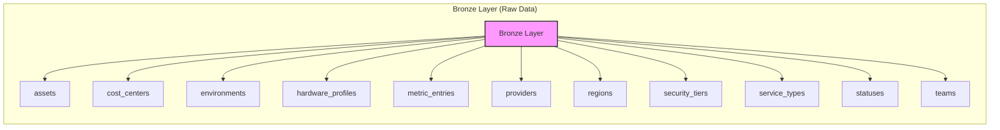

```mermaid
graph TD
    subgraph Storage_Layer ["Bronze Layer (Raw Data)"]
        direction TB
        BRONZE[Bronze Layer]
        
        %% Table Entities
        ASSETS[assets]
        CC[cost_centers]
        ENV[environments]
        HW[hardware_profiles]
        METRIC[metric_entries]
        PROV[providers]
        REG[regions]
        SEC[security_tiers]
        SERV[service_types]
        STAT[statuses]
        TEAM[teams]

        %% Connections
        BRONZE --> ASSETS
        BRONZE --> CC
        BRONZE --> ENV
        BRONZE --> HW
        BRONZE --> METRIC
        BRONZE --> PROV
        BRONZE --> REG
        BRONZE --> SEC
        BRONZE --> SERV
        BRONZE --> STAT
        BRONZE --> TEAM
    end

    style BRONZE fill:#f9f,stroke:#333,stroke-width:2px
```