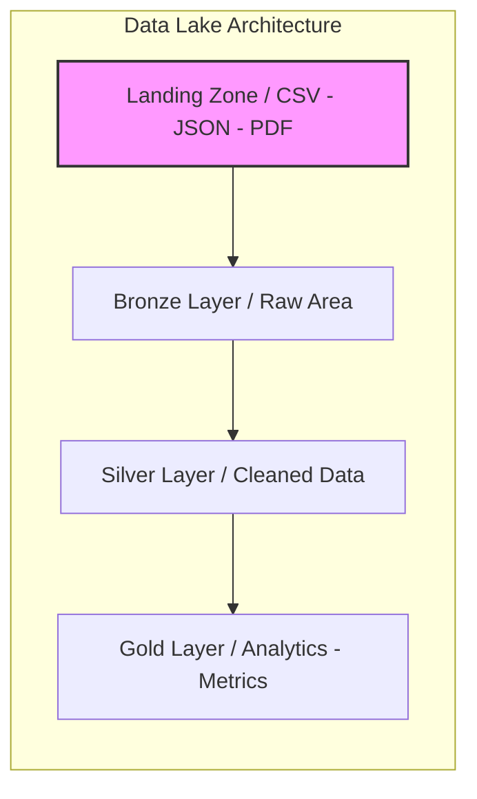

```mermaid
graph TD
    subgraph Data_Lake_Architecture ["Data Lake Architecture"]
        direction TB
        LZ[Landing Zone / CSV - JSON - PDF]
        
        %% Layers
        BRONZE[Bronze Layer / Raw Area]
        %% Connections
        LZ --> BRONZE
  
        %% Layers
        SILVER[Silver Layer / Cleaned Data]
        %% Connections
        BRONZE --> SILVER

        %% Layers
        GOLD[Gold Layer / Analytics - Metrics]
        %% Connections
        SILVER --> GOLD

    end

    style LZ fill:#f9f,stroke:#333,stroke-width:2px
```