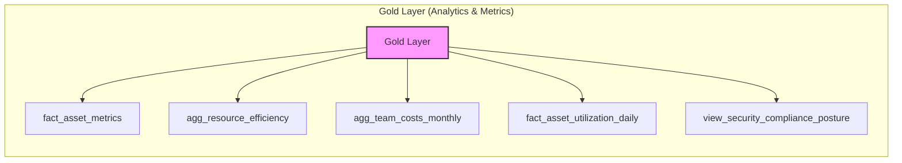

```mermaid
graph TD
    subgraph Storage_Layer ["Gold Layer (Analytics & Metrics)"]
        direction TB
        GOLD[Gold Layer]
        
        %% Table Entities
        F_ASSET_METRICS[fact_asset_metrics]
        AGG_RES_EFF[agg_resource_efficiency]
        AGG_TEAM_COSTS_M[agg_team_costs_monthly]
        F_ASSET_DAILY[fact_asset_utilization_daily]
        V_SEC_COMPLIANCE[view_security_compliance_posture]

        %% Connections
        GOLD --> F_ASSET_METRICS
        GOLD --> AGG_RES_EFF
        GOLD --> AGG_TEAM_COSTS_M
        GOLD --> F_ASSET_DAILY
        GOLD --> V_SEC_COMPLIANCE
    end

    style GOLD fill:#f9f,stroke:#333,stroke-width:2px
```