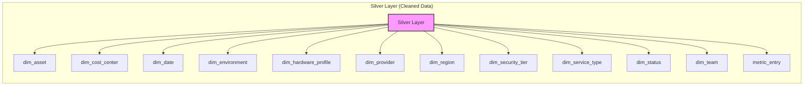

```mermaid
graph TD
    subgraph Storage_Layer ["Silver Layer (Cleaned Data)"]
        direction TB
        SILVER[Silver Layer]
        
        %% Table Entities
        DIM_ASSET[dim_asset]
        DIM_CC[dim_cost_center]
        DIM_DATE[dim_date]
        DIM_ENV[dim_environment]
        DIM_HW[dim_hardware_profile]   
        DIM_PROV[dim_provider]
        DIM_REG[dim_region]
        DIM_SEC[dim_security_tier]
        DIM_SERV[dim_service_type]
        DIM_STAT[dim_status]
        DIM_TEAM[dim_team]
        METRIC[metric_entry]

        %% Connections
        SILVER --> DIM_ASSET
        SILVER --> DIM_CC
        SILVER --> DIM_DATE
        SILVER --> DIM_ENV
        SILVER --> DIM_HW
        SILVER --> DIM_PROV
        SILVER --> DIM_REG
        SILVER --> DIM_SEC
        SILVER --> DIM_SERV
        SILVER --> DIM_STAT
        SILVER --> DIM_TEAM
        SILVER --> METRIC
    end

    style SILVER fill:#f9f,stroke:#333,stroke-width:2px
```